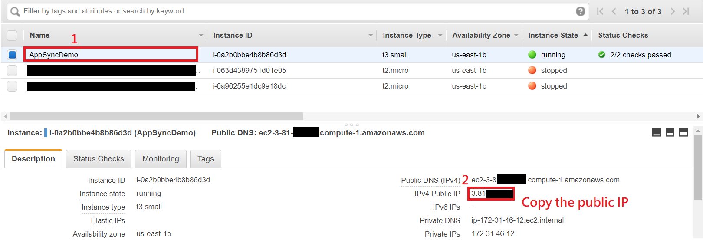
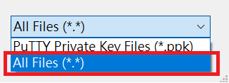
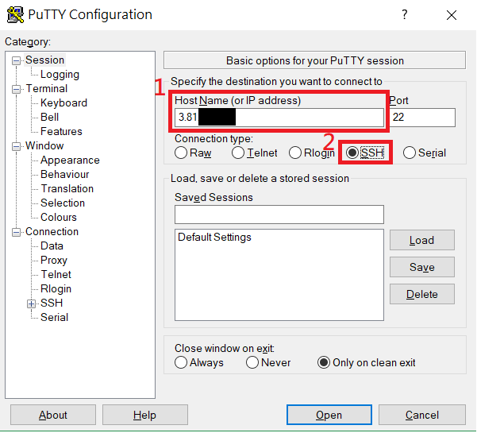
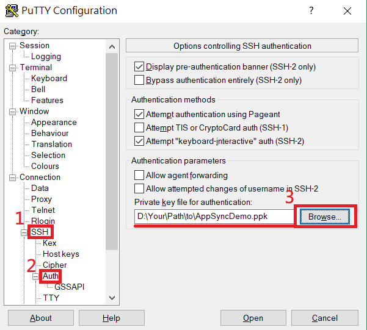
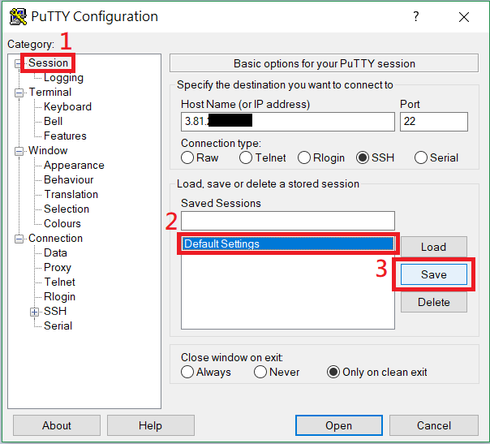
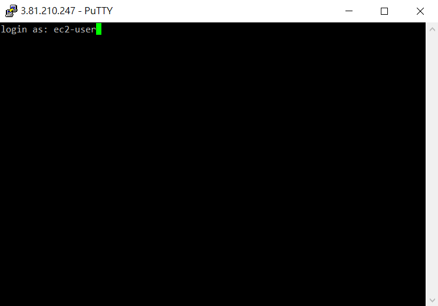
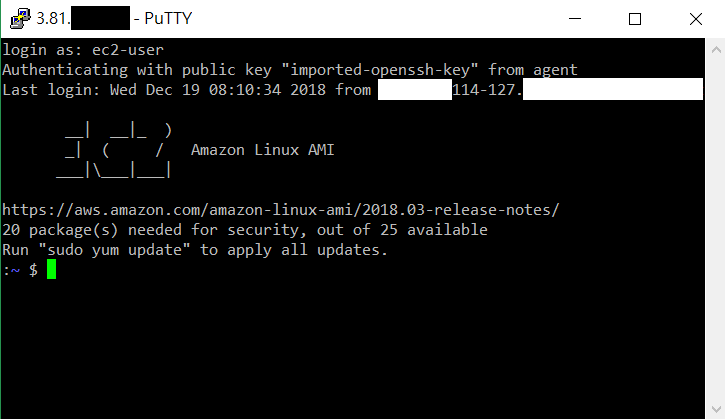
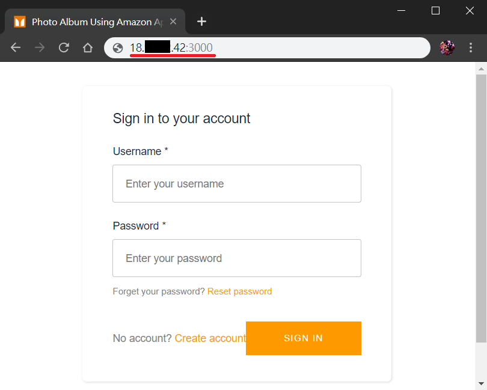

# Build a Photo Album Severless Application Using AWS AppSync

AWS AppSync is a GraphQL-based serverless backend for mobile, web and enterprise applications. In this tutorial, you will use the following tools to build a photo album web application using AWS AppSync. 

This tutorial refers to _**[the Github repository](https://github.com/gabehollombe-aws/react-graphql-amplify-blog-post) of Gabe Hollombe, AWS Software Developer & Technical Evangelist**_.

Please follow our instructions to create an EC2 instance and install the following tools on it. If you prefer to install them on your own computer, please refer to the URLs below for installation and skip to [Deploy App Backend via AWS Amplify](#deploy-app-backend-via-aws-amplify).

* **Node.js** - This tutorial use some JavaScript tools and packages which require Node.js (and Node Package Manager, which comes with Node.js) to be installed. For more information, please refer to https://nodejs.org/en/download/.

* **AWS SAM CLI** - This tutorial uses a tool from AWS to help with packaging and deploying AWS Lambda functions called the AWS Serverless Application Model (SAM) and SAM CLI. To install it on your own computer, please follow the installation instructions for SAM CLI, which will also require you to install Docker: https://github.com/awslabs/aws-sam-cli/blob/develop/docs/installation.rst.

* **AWS Amplify CLI** - AWS Amplify CLI helps us quickly configure serverless backends and includes support for authentication, analytics, functions, REST/GraphQL APIs, and more. Follow the installation instructions at https://github.com/aws-amplify/amplify-cli.

## List of Contents

* [Pre-requisites](#pre-requisites)
* [Create an EC2 Linux Instance](#create-an-ec2-linux-instance)
* [Connect to EC2 Linux Instance](#connect-to-ec2-linux-instance)
* [Install Required Tools](#install-required-tools)
* [Deploy App Backend via AWS Amplify](#deploy-app-backend-via-aws-amplify)
* [Clean Resources](#clean-resources)
* [Conclusion](#conclusion)

## Pre-requisites

* An AWS account.

* Make sure the region is **US East (N. Virginia)**, which its short name is **us-east-1**.

## Create an EC2 Linux Instance

* Login to [AWS console](https://console.aws.amazon.com/console/home?region=us-east-1) and make sure the region is **N. Virginia**.

* On upper panel, click **Services** -> **EC2**.

* Click **Launch Instance**.

* For AMI, select **Amazon Linux 2 AMI (HVM), SSD Volume Type** (which its AMI ID is ami-009d6802948d06e52) with **64-bit (x86)**.

圖片

* For instance type, choose **t3.small** and click **Next: Configure Instance Details**.

* In **Auto-assign Public IP**, select **Enable**.

* Keep the rest setting as default, click **Next: Add Storage**.

* Click **Next: Add Tags**.

* Click **Add Tag** button on left side to add a tag. 

* Enter the following information for the new tag.

  * In **Key**, type **`Name`**.

  * In **Value**, type **`AppSyncDemo`**.

* Click **Next: Configure Security Group**.

* Select **Create a new security group**.

* In **Security group name**, type **`Allow port 3000 and SSH`**

* Click **Add Rule** button to add a new rule.

* For the new rule, please follow the following setting:

  * In **Type**, select **Custom TCP Rule**

  * In **Port Range**, type **`3000`**.

  * In **Source**, select **Anywhere**.

圖片

* Click **Review and Launch**.

* Click **Launch**.

* Click **Create a new key pair**.

* In **Key pair name**, type **AppSyncDemo**.

* Click **Download Key Pair** to download key pair file.

> Note that you can only download the key pair file this time. You will not be able to download the file again after it's created.

* Click **Launch Instances**.

* Click **View Instances**.

## Connect to EC2 Linux Instance

### Get EC2 Instance's IP

* Go to [EC2 Management Console](https://console.aws.amazon.com/ec2/v2/home?region=us-east-1#Instances:sort=instanceState).

* Choose the EC2 Instance you want to connect.

* On lower panel, you can see the instance's **IPv4 Public IP**.

* Remember or copy the IP because you will use it later.
  
  

### Use PuTTY to Connect to EC2 Linux Instance (Windows only)

* Download and install PuTTY from [here](https://www.chiark.greenend.org.uk/~sgtatham/putty/latest.html). PuTTY is a free SSH client for Windows which can be used to connect to EC2 instances.

  > It is recommended to install PuTTY via official Windows Installer (the .msi file).

* Before start connecting, we first need to use **puttygen** to convert our key pair file from .pem format to .ppk format since PuTTY requires .ppk format. 

  Execute **puttygen.exe**.

  > puttygen.exe should be installed together if you had installed PuTTY via official Windows Installer. If you can't find puttygen.exe, try to press **`Win + S`** (**`Win + F`** for Win 7) and type **`puttygen`** to search the execution file.

* Click **Load** button and select the **AppSyncDemo.pem** you downloaded.

  > Select **`All files (*.*)`** in file browser, otherwise you won't be able to see AppSyncDemo.pem file.
  

* Click **Save private key** to save in .ppk format.

* Click **Yes** to ignore the warning message.

* Type **`AppSyncDemo.ppk`** and click **Save**.

* Execute **putty.exe**.

* In the blank of **Host Name(or IP address)**, paste or type the instance's public IP and select **SSH** as connection type. 

  

* Double-click **SSH** category on left side to expand.

* Click **Auth** category.

* Click **Browse...** button to import **AppSyncDemo.ppk** file.

  

* (Optional) You can save your settings as **Default Settings** so that you don't need to set up next time.
  * Click **Session** category on left side.
  * Click **Default Settings** below.
  * Click **Save** button.
  

* Click **Open** button below to start connecting.

* Click **Yes** to ignore the warning.

* If you see **login as:**, that means you have successfully connected to the instance.

* Type **ec2-user** to login.
  > **ec2-user** is the built-in user for most of EC2 Linux instance. If you can't login successfully, please check below:
  > * For Amazon Linux 2 or the Amazon Linux AMI, the user name is ec2-user.
  > * For a Centos AMI, the user name is centos.
  > * For a Debian AMI, the user name is admin or root.
  > * For a Fedora AMI, the user name is ec2-user or fedora.
  > * For a RHEL AMI, the user name is ec2-user or root.
  > * For a SUSE AMI, the user name is ec2-user or root.
  > * For an Ubuntu AMI, the user name is ubuntu.
  > * Otherwise, if ec2-user and root don't work, check with the AMI provider.

  

* If you see the welcome message below, you can start managing your Linux instance.

  

### Use SSH to Connect to EC2 Linux Instance (Linux / macOS)

* If you don't have a SSH client yet, please check http://www.openssh.com/.

* Open a **Terminal**.

* Change the directories to the location of **AppSyncDemo.pem**.

      cd /path/to/AppSyncDemo.pem

* Use the following command to set the permissions of the key pair file.

      chmod 400 AppSyncDemo.pem

* Use the following command to start a SSH connection where `EC2_INSTANCE_IP` is the public IP we mentioned in previous one section.
  > Make sure that you have replaced `EC2_INSTANCE_IP` with the public IP of your instance.

  > **ec2-user** is the built-in user for most of EC2 Linux instance. If you can't login successfully, please check below:
  > * For Amazon Linux 2 or the Amazon Linux AMI, the user name is ec2-user.
  > * For a Centos AMI, the user name is centos.
  > * For a Debian AMI, the user name is admin or root.
  > * For a Fedora AMI, the user name is ec2-user or fedora.
  > * For a RHEL AMI, the user name is ec2-user or root.
  > * For a SUSE AMI, the user name is ec2-user or root.
  > * For an Ubuntu AMI, the user name is ubuntu.
  > * Otherwise, if ec2-user and root don't work, check with the AMI provider.

      ssh -i AppSyncDemo.pem ec2-user@EC2_INSTANCE_IP

* Enter **yes** when you see the following message.

      The authenticity of host 'xxx.xxx.xxx.xxx (xxx.xxx.xxx.xxx)' can't be established.
      ECDSA key fingerprint is SHA256:H0NHIoNi1helKgCyYxG8pzECQm8tvhQ++xxxxxxxxxx.
      Are you sure you want to continue connecting (yes/no)? yes

* Start managing your instance after displaying welcome message.

      Warning: Permanently added 'xxx.xxx.xxx.xxx' (ECDSA) to the list of known hosts.
      Last login: Wed Dec 19 08:11:46 2018 from xxx-xxx-114-127

            __|  __|_  )
            _|  (     /   Amazon Linux AMI
            ___|\___|___|

      https://aws.amazon.com/amazon-linux-ami/2018.03-release-notes/
      20 package(s) needed for security, out of 25 available
      Run "sudo yum update" to apply all updates.
      :~ $

## Install Required Tools

After connecting to the EC2 instance, install tools by following the instructions below.

### Install Node.js

The Linux AMI we used in this tutorial is based on RHEL/CentOS 7. Referring to [NodeSource](https://github.com/nodesource/distributions/blob/master/README.md), we can install Node.js via package manager, but we first need to run provided script as root to fetch Node.js package.

* Activate the root user and give a password for it.

      sudo passwd root

* Switch to root user.

      su root

* Install Node.js by running the script provided by NodeSource.
      
      curl -sL https://rpm.nodesource.com/setup_10.x | bash -

* Switch back to ec2-user.

      su ec2-user

* Install Node.js via package manager.

      sudo yum install nodejs

* Check the installation. You should be able to see the version of Node Package Manager (which comes with Node.js) if you have installed successfully.

      npm --version

### Install SAM

AWS SAM can be installed via pip, a package manager for Python. Also, SAM requires Docker installed to run projects and functions locally. 

In this tutorial, the Linux AMI we used has installed Python 2.7 by default, but we still need to install pip and Docker ourselves. 

* **Install Pip**

  * Check that Python has installed and the version is 2.7+.
    
        python --version

  * Download the officlal installation script by running the following command.

        curl https://bootstrap.pypa.io/get-pip.py -o get-pip.py

  * Run the script to install.

        sudo python get-pip.py

  * Check the installation, you should be able to see the version of pip.

        pip --version

* **Install Docker**

  * Run the following command provided by AwS to install Docker.

        sudo amazon-linux-extras install docker

  * Start Docker Daemon.

        sudo service docker start

* **Install SAM**

  * Upgrade Jinja2 due to the package dependency problem.

        sudo pip install --upgrade jinja2

  * Install GCC.

        sudo yum install gcc

  * Uninstall built-in AWS Command-line Interface (AWS CLI). The old built-in version (installed via yum package manager) exists package dependency problem, therefore we unintall it.

        sudo yum remove awscli
        
  * (Optional) You can re-install the latest version AWS CLI via pip.

        pip install awscli --upgrade --user
      
  * Install SAM via pip.
      
        pip install --user aws-sam-cli

  * Check the installation, you should be able to see the version of SAM.

        sam --version

### Install AWS Amplify

* Install AWS Amplify via Node Package Manager.

      sudo npm install -g @aws-amplify/cli
      
* Configure your AWS credential and follow the prompt:

      amplify configure
      
  * Login to [AWS Management Console](https://console.aws.amazon.com/console/home?region=us-east-1), then press `Enter` to continue
  * Specify the AWS region: `us-east-1`
  * Specify the username of the new IAM user: `<anything you want>`
  * **Visit the URL** from the prompt to create a new IAM user for **programmatic access**. After creating, press `Enter` to continue.
    > If you want to use existing IAM user, just press `Enter` to continue.
  * accessKeyId: `<YOUR_ACCESS_KEY_ID>`
  * secretAccessKey: `<YOUR_SECRET_ACCESS_KEY>`
  * Profile Name: `default`

## Deploy App Backend via AWS Amplify

### Clone App to Local

* Install Git if you haven't installed yet.

      sudo yum install git

* Clone App from this repositoy.

      git clone https://github.com/ecloudvalley/Build-a-Photo-Album-Severless-Application-Using-AWS-AppSync.git appsync

* Change directory to the App folder.

      cd appsync

### Install Required Packages for App

* Enter the following command:

      sudo npm install

### Initialize AWS Amplify

* Enter the following command:

      amplify init

* Answer the questions like this:
  * Choose your default editor: `<Anything you want>`
  * Choose the type of app that you're building: `Javascript`
  * What javascript framework are you using: `React`
  * Source Directory Path:  `src`
  * Distribution Directory Path: `build`
  * Build Command:  `npm run-script build`
  * Start Command: `npm run-script start`
  * Do you want to use an AWS profile? `y`
  * Please choose the profile you want to use: `default`
  * Wait until finishing.

### Deploy Cognito User Pool for Authentication.

* Enter the following command:

      amplify auth add

* Answer the questions like this:
  * Do you want to use the default authentication and security configuration?
  
     `Yes, use the default configuration.`

* Deploy on the cloud.

      amplify push

* Press `Enter/Return` to continue, and wait for it to finish.

### Deploy AppSync (GraphQL) API

* Enter the following command:

      amplify api add

* Answer the questions like this:
  * Please select from one of the below mentioned services `GraphQL`
  * Provide API name: `AppSyncDemo`
  * Choose an authorization type for the API `Amazon Cognito User Pool`
  * Do you have an annotated GraphQL schema? `Yes`
  * Provide your schema file path: `scripts/bootstrapping/schema.graphql`

* Deploy on the cloud.

      amplify push

* Press `Enter/Return` to continue.

* Do you want to generate code for your newly created GraphQL API? `No`

  If you answer `Yes`, the GraphQL operations corresponding to your API will be generated in the selected programming language.

* Wait for it to finish.

### Deploy S3 File Storage

* Enter the following command:

      amplify storage add

* Answer the questions like this:
  * Please select from one of the below mentioned services `Content (Images, audio, video, etc.)`
  * Please provide a friendly name for your resource that will be used to label this category in the project: `AppSyncDemoPhotoStorage`
  * Please provide bucket name: `<accept the default value>`
  * Who should have access: `Auth users only`
  * What kind of access do you want for Authenticated users `read/write`

* Deploy on the cloud.

       amplify push

* Press `Enter/Return` to continue, and wait for it to finish

### Run Bootstrap Script 

* Enter the following command to run script:

      npm run bootstrap

* (Optional) If problems occurred, try the following command:

      bash /scripts/bootstrapping/bootstrap_app.sh

  > **What this script does:**
  > * Packages and deploys the `photo_processor` Lambda function, configuring it to trigger when new photos are uploaded to the S3 bucket used for storage configured by Amplify
  > * Updates the AppSync API schema and resolvers to be in-line with what this codebase expects (so you don't need to make manual changes in the AppSync web console). 
  > * Adds an explicit `Deny` on `s3:ListBucket` for the IAM role associated with authenticated users in the app
  > * Re-creates a Global Secondary Index on the DynamoDB table used for the PhotoTable AppSync data source to allow fetching items in reverse chronological order

  > **Notes:**
  > - Ths script uses credentials stored in ~/.aws/credentials (macOS/Linux) or C:\Users\USER_NAME\.aws\credentials (Windows). 
  > - If you have a specific AWS credentials profile you want to use, prefix the command with AWS_PROFILE=name-of-profile
  > - It requires Node.js version 8 or higher and Docker to be installed

### Start the App

* Enter the command below to start application with a lightweight web server.
      
      npm start

* Visit **`http://YOUR_INSTANCE_IP:3000`**, you should be able to see the home page as below.

  > Make sure to replace `YOUR_INSTANCE_IP` with your EC2 instance's public IP.

### Host Static Website on S3

#### Build as Static Web Application

* Press `ctrl + C` to stop the application.

* Build as static web application with the following command:

      npm run build

  > Make sure the instance type you selected has at least **2 GB** RAM. 

* Create a S3 bucket with a unique name via AWS CLI:

      aws s3 mb s3://YOUR_BUCKET_NAME

> Make sure to replace `YOUR_BUCKET_NAME` with a unique name.

* Upload build files to S3 bucket.

      aws s3 cp build/ s3://YOUR_BUCKET_NAME

* Go to [Amazon S3 console](https://console.aws.amazon.com/s3/home).

* Search and click the newly created bucket.

* Select **Properties** tab.

* Click **Static website hosting**.

* Select **Use this bucket to host a website**.

* Type **index.html** for the index document, then click **Save**.

* Click **Bucket Policy** tab in **Permissions** tab.
> When you configure a bucket as a website, you have to make the objects that you want to serve publicly readable. 

* Copy the bucket policy below, and paste it into the field. 

  > Make sure you have replaced **`<YOUR_BUCKET_NAME>`** with the bucket name then click **Save**.

      {
      "Version": "2012-10-17",
      "Statement": [
            {
                  "Sid": "PublicReadGetObject",
                  "Effect": "Allow",
                  "Principal": "*",
                  "Action": [
                  "s3:GetObject"
                  ],
                  "Resource": [
                  "arn:aws:s3:::<YOUR_BUCKET_NAME>/*"
                  ]
            }
      ]
      }

* Select **Properties** tab.

* Click **Static website hosting**.

* Visit **the URL** displays on upper side.

* You should be able to see the home page.

# Clean Resources

* Delete the stacks named with **`appsync`** prefix on [AWS CloudFormation](https://console.aws.amazon.com/cloudformation/home?region=us-east-1#/stacks?filter=active).
* Delete created S3 bucket which hosts a static website.
* Delete the secret creadential of created IAM user.

# Conclusion

You have learned:
* Use Amplify to deploy authentication.
* Use Amplify to deploy AppSync API.
* Use Amplify to deploy S3 storage bucket.